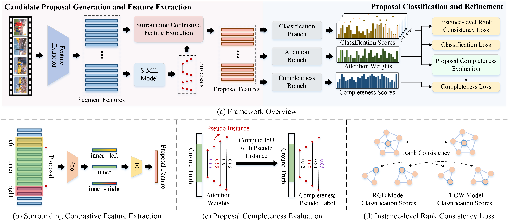

# Proposal-based Multiple Instance Learning for Weakly-supervised Temporal Action Localization (CVPR 2023)

Huan Ren, Wenfei Yang, Tianzhu Zhang, Yongdong Zhang (USTC)

[](https://arxiv.org/abs/2305.17861) [](https://openaccess.thecvf.com/content/CVPR2023/html/Ren_Proposal-Based_Multiple_Instance_Learning_for_Weakly-Supervised_Temporal_Action_Localization_CVPR_2023_paper) [](https://renhuan1999.github.io/P-MIL)



## Requirements

* Python 3.8
* Pytorch 1.8.0
* CUDA 11.1

Required packages are listed in `requirements.txt`. You can install by running:

```bash
conda create -n P-MIL python=3.8
conda activate P-MIL
conda install pytorch==1.8.0 torchvision==0.9.0 torchaudio==0.8.0 cudatoolkit=11.1 -c pytorch -c conda-forge
pip3 install -r requirements.txt
```

## Data Preparation
1. Prepare [THUMOS14](https://www.crcv.ucf.edu/THUMOS14/) dataset.
    * We recommend using features and annotations provided by [W-TALC](https://github.com/sujoyp/wtalc-pytorch) or [CO2-Net](https://github.com/harlanhong/MM2021-CO2-Net).
    * You can also get access of it from [Google Drive](https://drive.google.com/drive/folders/1RFNa0bEz9adEDB4xmVXPYfCGB-D_Y1wR?usp=share_link).

2. Prepare proposals generated from pre-trained S-MIL model.
    * We recommend using their official codes (such as [CO2-Net](https://github.com/harlanhong/MM2021-CO2-Net)) to generate proposals.
    * You can just download the proposals used in our paper from [Google Drive](https://drive.google.com/drive/folders/1yvxpT2Zg8nR3dqjPTOkTxoJuwZd-x7PG?usp=share_link).

3. Place the features and annotations inside a `data/Thumos14reduced/` folder and proposals inside a `proposals` folder. Make sure the data structure is as below.

```
    ├── data
        └── Thumos14reduced
            ├── Thumos14reduced-I3D-JOINTFeatures.npy
            └── Thumos14reduced-Annotations
                ├── Ambiguous_test.txt
                ├── classlist.npy
                ├── duration.npy
                ├── extracted_fps.npy
                ├── labels_all.npy
                ├── labels.npy
                ├── original_fps.npy
                ├── segments.npy
                ├── subset.npy
                └── videoname.npy
    ├── proposals
        ├── detection_result_base_test.json
        ├── detection_result_base_train.json
```

## Running

### Training

```bash
CUDA_VISIBLE_DEVICES=0 python main.py --run_type train
```

### Testing

The pre-trained model can be downloaded from [Google Drive](https://drive.google.com/file/d/1B5KeF5v_eBzyzMZSni9QNaWlipE0q3O7/view?usp=share_link), which is then placed inside a `checkpoints` folder.

```bash
CUDA_VISIBLE_DEVICES=0 python main.py --run_type test --pretrained_ckpt checkpoints/best_model.pkl
```

## Results

The experimental results on THUMOS14 are as below. Note that the performance of checkpoints we provided is slightly different from the orignal paper!

| Method \ mAP@IoU (%) | 0.1  | 0.2  | 0.3  | 0.4  | 0.5  | 0.6  | 0.7  | AVG  |
| -------------------- | ---- | ---- | ---- | ---- | ---- | ---- | ---- | ---- |
| P-MIL                | 70.8 | 66.5 | 57.8 | 48.6 | 39.8 | 27.0 | 14.3 | 46.4 |

## Citation

```
@InProceedings{Ren_2023_CVPR,
    author    = {Ren, Huan and Yang, Wenfei and Zhang, Tianzhu and Zhang, Yongdong},
    title     = {Proposal-Based Multiple Instance Learning for Weakly-Supervised Temporal Action Localization},
    booktitle = {Proceedings of the IEEE/CVF Conference on Computer Vision and Pattern Recognition (CVPR)},
    month     = {June},
    year      = {2023},
    pages     = {2394-2404}
}
```

## Acknowledgement

We referenced the repos below for the code.

- [W-TALC](https://github.com/sujoyp/wtalc-pytorch)
- [CO2-Net](https://github.com/harlanhong/MM2021-CO2-Net)
- [RSKP](https://github.com/LeonHLJ/RSKP)
